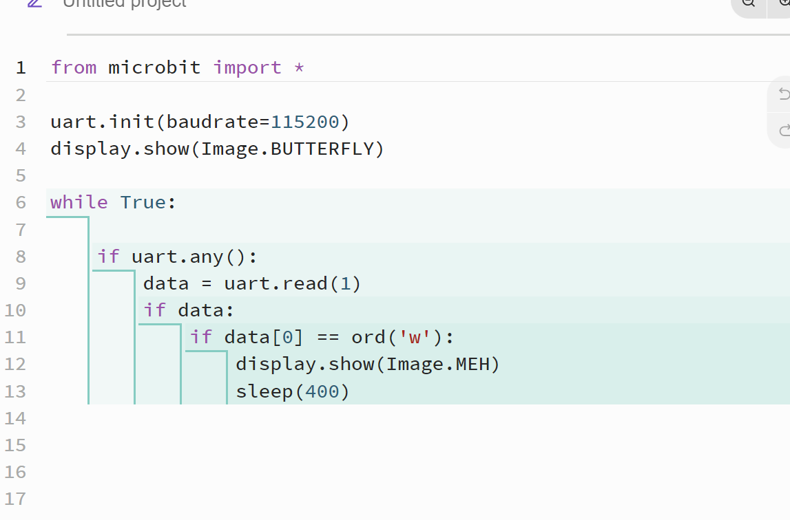

## Documentación del Código

### Descripción

Este programa, escrito en JavaScript utilizando la biblioteca p5.js y p5.serialport, permite la conexión de una placa micro:bit a través de un puerto serie. También proporciona una interfaz gráfica para conectar y enviar datos a la micro:bit.

## Funciones y Procedimiento

### 1. Configuración Inicial (setup)

Se crea un lienzo de 400x400 píxeles.

Se inicializa un objeto port para manejar la comunicación serie.

Se crean dos botones:

connectBtn: Permite conectar o desconectar la micro:bit.

sendBtn: Envía el comando 'w' a la micro:bit cuando se presiona.

### 2. Dibujo Continuo (draw)

Se verifica si el puerto está abierto.

Se actualiza el texto del botón connectBtn para reflejar el estado de conexión:

"Connect to micro:bit" cuando el puerto está cerrado.

"Disconnect" cuando el puerto está abierto.

### 3. Manejo de Conexión (connectBtnClick)

Si el puerto está cerrado, intenta abrir la conexión con la micro:bit a una velocidad de 115200 baudios.

Si el puerto está abierto, lo cierra.

### 4. Envío de Datos (sendBtnClick)

Se envía el carácter 'w' a través del puerto serie, lo que puede ser interpretado por la micro:bit para ejecutar una acción específica.

