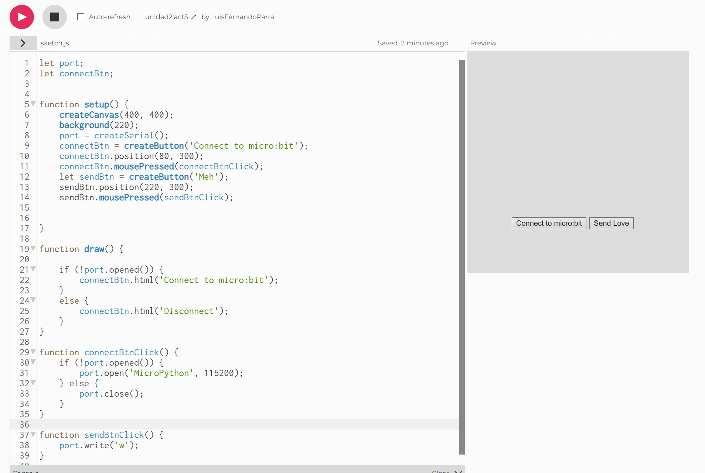

# Documentación: Comunicación entre micro:bit y p5.js mediante UART

## Introducción
Este documento describe el funcionamiento de dos programas que permiten la comunicación entre una placa **micro:bit** y una interfaz web construida con **p5.js** mediante el protocolo **UART (Universal Asynchronous Receiver-Transmitter)**.

## 1. Código en MicroPython (micro:bit)

### Descripción
El código en **MicroPython** se ejecuta en la placa **micro:bit** y realiza las siguientes acciones:

1. Inicializa la comunicación **UART** a una velocidad de **115200 baudios**.
2. Muestra una imagen de mariposa (`Image.BUTTERFLY`) en la pantalla LED al iniciar.
3. En un bucle infinito:
   - Verifica si hay datos entrantes por **UART**.
   - Si recibe la letra `'w'`, muestra una secuencia de imágenes (`MEH`, `HAPPY`, `SAD`) con pausas de **400 ms** entre cada una.

### Código
```python
from microbit import *

uart.init(baudrate=115200)
display.show(Image.BUTTERFLY)

while True:
    if uart.any():
        data = uart.read(1)
        if data:
            if data[0] == ord('w'):
                display.show(Image.MEH)
                sleep(400)
                display.show(Image.HAPPY)
                sleep(400)
                display.show(Image.SAD)
                sleep(400)
```

### Funcionamiento
- **`uart.init(baudrate=115200)`**: Configura la comunicación serie a **115200 baudios**.
- **`uart.any()`**: Comprueba si hay datos disponibles en el buffer de recepción.
- **`uart.read(1)`**: Lee un byte de los datos recibidos.
- **`ord('w')`**: Convierte el carácter `'w'` en su valor ASCII para compararlo con los datos recibidos.
- **`display.show(Image.XXX)`**: Muestra diferentes imágenes en la pantalla LED de la micro:bit.

## 2. Código en JavaScript (p5.js)

### Descripción
El código en **JavaScript (p5.js)** crea una interfaz web que permite conectar la micro:bit y enviarle comandos a través del puerto serie.

### Código
```javascript
let port;
let connectBtn;

function setup() {
    createCanvas(400, 400);
    background(220);
    port = createSerial();
    connectBtn = createButton('Connect to micro:bit');
    connectBtn.position(80, 300);
    connectBtn.mousePressed(connectBtnClick);
    let sendBtn = createButton('Meh');
    sendBtn.position(220, 300);
    sendBtn.mousePressed(sendBtnClick);
}

function draw() {
    if (!port.opened()) {
        connectBtn.html('Connect to micro:bit');
    }
    else {
        connectBtn.html('Disconnect');
    }
}

function connectBtnClick() {
    if (!port.opened()) {
        port.open('MicroPython', 115200);
    } else {
        port.close();
    }
}

function sendBtnClick() {
    port.write('w');
}
```

### Funcionamiento
- **`createSerial()`**: Crea una instancia de comunicación serie.
- **`createButton('Connect to micro:bit')`**: Crea un botón para conectar o desconectar la micro:bit.
- **`port.open('MicroPython', 115200)`**: Abre la conexión UART a 115200 baudios.
- **`port.close()`**: Cierra la conexión con la micro:bit.
- **`port.write('w')`**: Envía la letra `'w'` al micro:bit para activar la animación.

## 3. Comunicación entre ambos códigos
1. Cuando el usuario presiona el botón "Meh" en la interfaz web, el código de **p5.js** envía el carácter `'w'` a la micro:bit a través de **UART**.
2. La micro:bit recibe `'w'`, lo interpreta y muestra la secuencia de imágenes en su pantalla LED.


