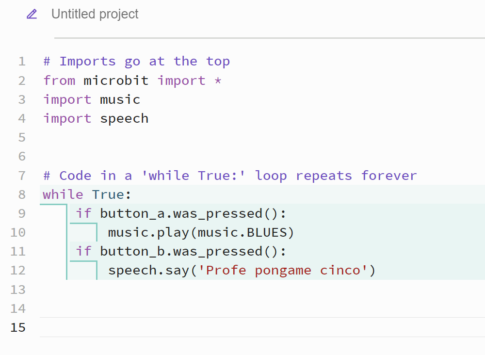

# Documentación del Código - micro:bit

## Descripción

Este programa en **MicroPython** está diseñado para ejecutarse en una placa **BBC micro:bit**. Su propósito es reaccionar a la pulsación de los botones físicos de la micro:bit y realizar dos acciones distintas:

- Si se presiona el **botón A**, se reproduce una melodía de blues.
- Si se presiona el **botón B**, el dispositivo dice en voz sintetizada la frase: _"Profe, póngame cinco"_.

## Requisitos

Para ejecutar este código correctamente, se necesita:

- Una **BBC micro:bit**.
- Un entorno de desarrollo compatible, como **Mu Editor** o **Thonny**.
- **MicroPython** instalado en la micro:bit.

## Código Fuente

```python
# Importaciones necesarias
from microbit import *
import music
import speech

# Bucle infinito para ejecutar continuamente el programa
while True:
    if button_a.was_pressed():
        music.play(music.BLUES)  # Reproduce una melodía de blues
    if button_b.was_pressed():
        speech.say('Profe pongame cinco')  # Dice la frase en voz sintetizada
